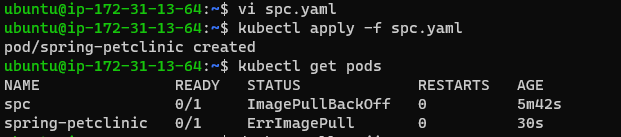
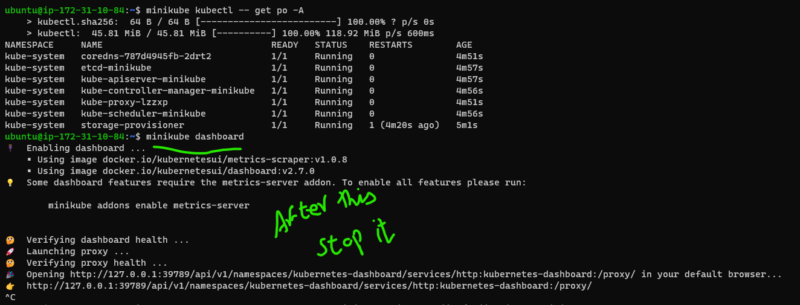
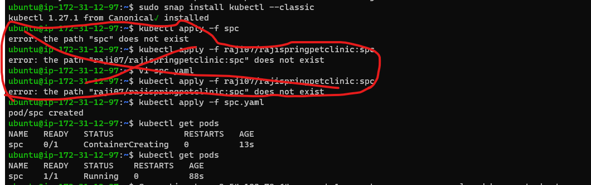

# Kubernetes

Kubernetes tasks:
-----------------
### Task 1st day 26/4/23
1) Write a Pod Spec for Spring PetClinic and nopCommerce Applications
In vs.code write a pod spec and apply it on k8s master 
In master terminal 
` vi spc.yaml `     
Check the docker hub registry to get our image example: raji07/rajispringpetclinic:spc  username/reponame:tagname 
` kubectl apply -f spc.yaml `        (it will apply for particular image)
check the pods status 
` kubectl get pods `

```yaml
Spring PetClinic
-----------------

---
apiVersion: v1
kind: Pod
metadata:
  name: spc
spec:
  containers:
    - name: spc
      image: raji07/rajispringpetclinic:spc
      ports:
        - containerPort: 8080
		
2) Nopcommerce
--------------
 vi spc.yaml 
 kubectl apply -f spc.yaml 
 kubectl get pods 

---
apiVersion: v1
kind: Pod
metadata:
   name: nopcommerce
spec:
   containers:
     - name: nopcommerce
      image: raji07/rajeshwari-nopcommerce:latest
      ports:
        - containerPort: 5000 
```
 

 


### 2. kubectl get pods and describe pods 
used commands:
--------------
` vi spc.yaml `
` kubectl apply -f spc.yaml `
` kubectl get pods `
In Master If we create in master we can see our ip adress of nodes 
form the above task continuation 
1.	` kubectl describe pods springpetclinic `
       we can see the status of application in the 

2.	` kubectl describe pods nopcommerce `
        we can see the status of application

If we create in master we can see our ip adress of nodes

Kubernetes (k8s) Activities (DAY02-27/APR/2023)
---------------------------------------------------------
### Task 2nd day 27/4/23

1) Explain Kubernetes architecture

A. Kubernetes is an architecture that offers a loosely coupled mechanism for service discovery across a cluster.
   A Kubernetes cluster has one or more control planes, and one or more compute nodes


### 2) Setup k8s on single node using minikube and kind  
   https://minikube.sigs.k8s.io/docs/start/ refer this document
# Minikube installation and run spc
* Create a liniux mancine i.e ec2 t2.medium 
* Then connect to the terminal and install docker commands 
* Install docker in vm 
* Next install kubectl refer this link  url:  https://minikube.sigs.k8s.io/docs/start/ in this follow the liniux commands 
use these commands: 
` curl -LO https://storage.googleapis.com/minikube/releases/latest/minikube-linux-amd64 `
` sudo install minikube-linux-amd64 /usr/local/bin/minikub `
` minikube start `
` minikube kubectl -- get po -A `
` minikube dashboard `
` alias kubectl="minikube kubectl --"  `
` kubectl create deployment hellospc-minikube --image=raji07/rajispringpetclinic:spc ` 
` kubectl expose deployment hellospc-minikube --type=NodePort --port=8080 `
` minikube service hellospc-minikube `
` kubectl port-forward --address "0.0.0.0" service/hellospc-minikube 7080:8080  `

# Kind
------
url: https://kind.sigs.k8s.io/docs/user/quick-start/ 

* Create a liniux mancine i.e ec2 t2.medium 
* Then connect to the terminal and install docker commands 
* Install docker in vm 

` curl -Lo ./kind https://kind.sigs.k8s.io/dl/v0.18.0/kind-linux-amd64 `
` chmod +x ./kind `
` sudo mv ./kind /usr/local/bin/kind `




### 3) Run the Spring Pet Clinic

A. Its running in port http://54.176.85.248:7080 


