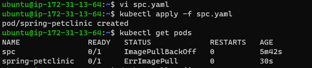
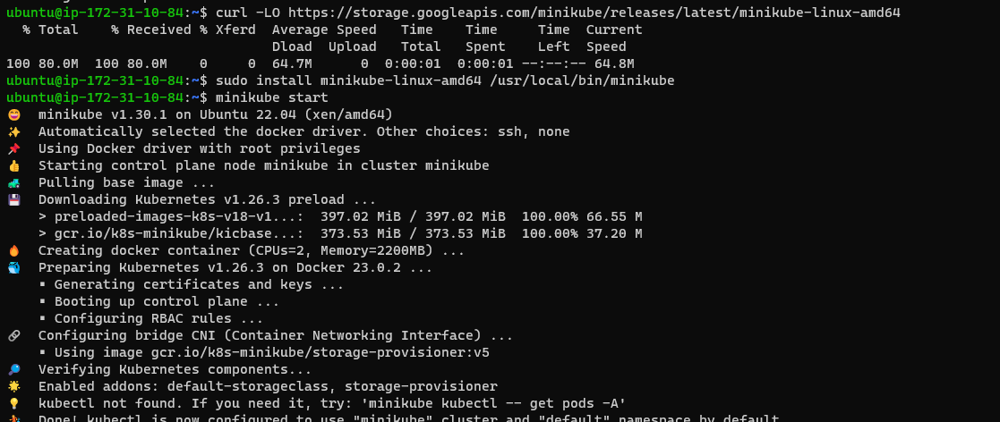
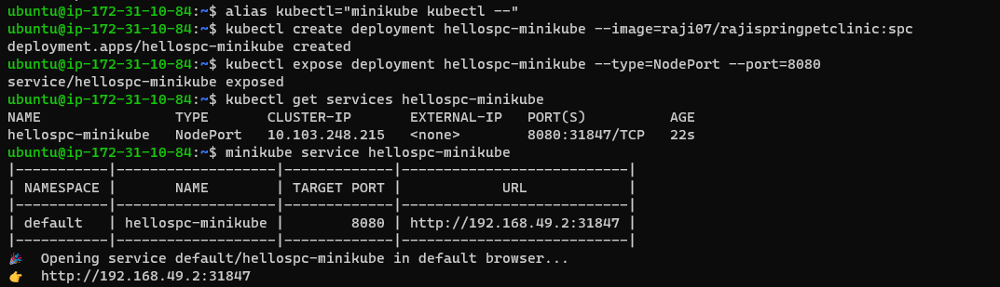
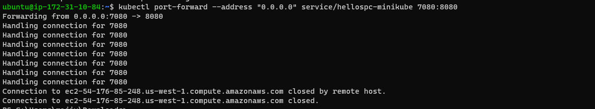
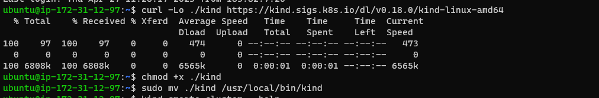
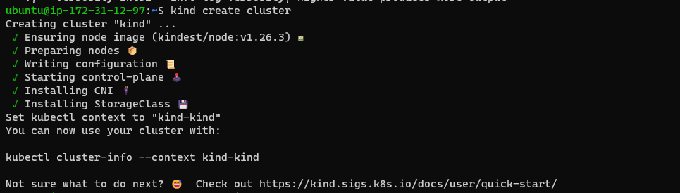
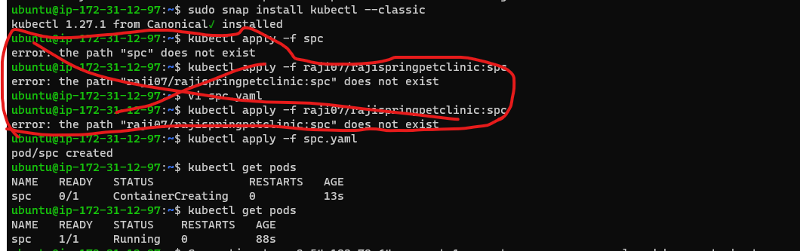
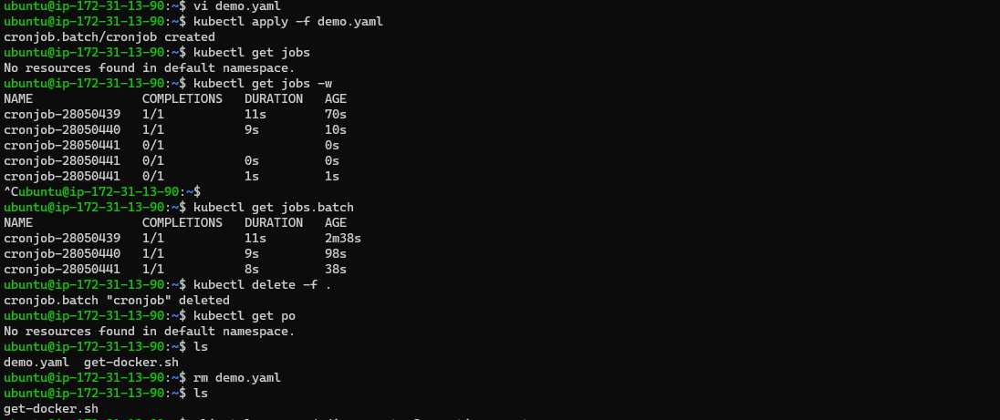
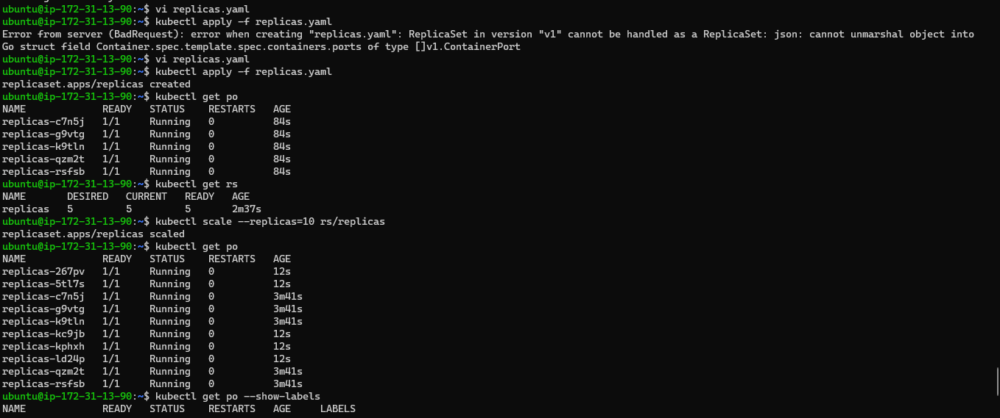
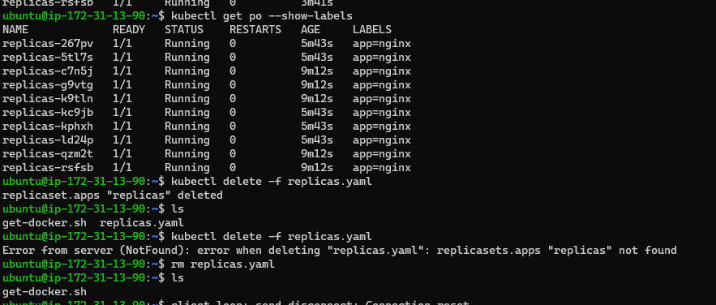

### Kubernetes installation steps:
 ----------------------------------
## These above steps all are used in Master , Node1, Node2
* docker 
  ------
curl -fsSL https://get.docker.com -o get-docker.sh
sh get-docker.sh
sudo usermod -aG docker ubuntu
exit
re-login
>> This url used for refernce steps[RefereHere](https://github.com/Mirantis/cri-dockerd)

# Run these commands as root user
* ### Install GO###

sudo -i
wget https://storage.googleapis.com/golang/getgo/installer_linux
chmod +x ./installer_linux
./installer_linux
source ~/.bash_profile
git clone https://github.com/Mirantis/cri-dockerd.git
cd cri-dockerd
mkdir bin
go build -o bin/cri-dockerd
mkdir -p /usr/local/bin
install -o root -g root -m 0755 bin/cri-dockerd /usr/local/bin/cri-dockerd
cp -a packaging/systemd/* /etc/systemd/system
sed -i -e 's,/usr/bin/cri-dockerd,/usr/local/bin/cri-dockerd,' /etc/systemd/system/cri-docker.service
systemctl daemon-reload
systemctl enable cri-docker.service
systemctl enable --now cri-docker.socket
cd ~
sudo apt-get update
sudo apt-get install -y apt-transport-https ca-certificates curl
sudo curl -fsSLo /etc/apt/keyrings/kubernetes-archive-keyring.gpg https://packages.cloud.google.com/apt/doc/apt-key.gpg
echo "deb [signed-by=/etc/apt/keyrings/kubernetes-archive-keyring.gpg] https://apt.kubernetes.io/ kubernetes-xenial main" | sudo tee /etc/apt/sources.list.d/kubernetes.list
sudo apt-get update
sudo apt-get install -y kubelet kubeadm kubectl
sudo apt-mark hold kubelet kubeadm kubectl
  
----------------------------------------------------------till here    

### Note use these command only in master

 This is oly for master 
 * kubeadm init --pod-network-cidr "10.244.0.0/16" --cri-socket "unix:///var/run/cri-dockerd.sock"
  
 * exit 

>> [ReferHere](https://kubernetes.io/docs/setup/production-environment/tools/kubeadm/create-cluster-kubeadm/)
 in master
 as a normal user (Ubuntu)

* mkdir -p $HOME/.kube
* sudo cp -i /etc/kubernetes/admin.conf $HOME/.kube/config
* sudo chown $(id -u):$(id -g) $HOME/.kube/config
* kubectl apply -f https://github.com/flannel-io/flannel/releases/latest/download/kube-flannel.yml
 

### use these commands in Node1, Node2 ( as a root user) afetr installattion we will get kubeadm output take that command and fix the cri socket network  in node 

* kubeadm join 172.31.36.73:6443 --token paqndf.xvzsuv4f7mctr3xs \
       --cri-socket "unix:///var/run/cri-dockerd.sock" \ 
        --discovery-token-ca-cert-hash sha256:b29c8db59af2357007431c22bc3c776a908618d7fb64cbafd533db70023f06de 

`above steps taken in master node successfully installation part`

### Then go to master and check the nodes 

` kubectl get nodes ` it shows the ip of nodes 


### Kubernetes tasks:
-----------------
### Task 1st day 26/4/23
1) Write a Pod Spec for Spring PetClinic and nopCommerce Applications
In vs.code write a pod spec and apply it on k8s master 
In master terminal 
` vi spc.yaml `     
Check the docker hub registry to get our image example: raji07/rajispringpetclinic:spc  username/reponame:tagname 
` kubectl apply -f spc.yaml `        (it will apply for particular image)
check the pods status 
` kubectl get pods `

```yaml
Spring PetClinic
-----------------

---
apiVersion: v1
kind: Pod
metadata:
  name: spc
spec:
  containers:
    - name: spc
      image: raji07/rajispringpetclinic:spc
      ports:
        - containerPort: 8080
		
2) Nopcommerce
--------------
 vi spc.yaml 
 kubectl apply -f spc.yaml 
 kubectl get pods 

---
apiVersion: v1
kind: Pod
metadata:
   name: nopcommerce
spec:
   containers:
     - name: nopcommerce
      image: raji07/rajeshwari-nopcommerce:latest
      ports:
        - containerPort: 5000 
```
 

 



### 2. kubectl get pods and describe pods 
used commands:
--------------
` vi spc.yaml `
` kubectl apply -f spc.yaml `
` kubectl get pods `
In Master If we create in master we can see our ip adress of nodes 
form the above task continuation 
1.	` kubectl describe pods springpetclinic `
       we can see the status of application in the 

2.	` kubectl describe pods nopcommerce `
        we can see the status of application

If we create in master we can see our ip adress of nodes

Kubernetes (k8s) Activities (DAY02-27/APR/2023)
---------------------------------------------------------
### Task 2nd day 27/4/23

1) Explain Kubernetes architecture

A. Kubernetes is an architecture that offers a loosely coupled mechanism for service discovery across a cluster.
   A Kubernetes cluster has one or more control planes, and one or more compute nodes


### 2) Setup k8s on single node using minikube and kind  
   https://minikube.sigs.k8s.io/docs/start/ refer this document
# Minikube installation and run spc
* Create a liniux mancine i.e ec2 t2.medium 
* Then connect to the terminal and install docker commands 
* Install docker in vm 
* Next install kubectl refer this link  url:  https://minikube.sigs.k8s.io/docs/start/ in this follow the liniux commands 
use these commands: 
` curl -LO https://storage.googleapis.com/minikube/releases/latest/minikube-linux-amd64 `
` sudo install minikube-linux-amd64 /usr/local/bin/minikub `
` minikube start `
` minikube kubectl -- get po -A `
` minikube dashboard `
` alias kubectl="minikube kubectl --"  `
` kubectl create deployment hellospc-minikube --image=raji07/rajispringpetclinic:spc ` 
` kubectl expose deployment hellospc-minikube --type=NodePort --port=8080 `
` minikube service hellospc-minikube `
` kubectl port-forward --address "0.0.0.0" service/hellospc-minikube 7080:8080  `

# Kind
------
url: https://kind.sigs.k8s.io/docs/user/quick-start/ 

* Create a liniux mancine i.e ec2 t2.medium 
* Then connect to the terminal and install docker commands 
* Install docker in vm 

` curl -Lo ./kind https://kind.sigs.k8s.io/dl/v0.18.0/kind-linux-amd64 `
` chmod +x ./kind `
` sudo mv ./kind /usr/local/bin/kind `





### 3) Run the Spring Pet Clinic

A. Its running in port http://54.176.85.248:7080 

### All activities in class given task on 3 day 3

https://kubernetes.io/docs/reference/generated/kubernetes-api/v1.27/#pod-v1-core 

```yaml 
---
apiVersion: batch/v1
kind: CronJob
metadata:
  name: cronjob
spec:
  schedule: "* * * * *"
  jobTemplate:
    metadata:
      name: cronjobdata
    spec:
      backoffLimit: 2
      template:
        metadata:
          name: cronjobpod
          labels: 
            purpose: execute
        spec:
          restartPolicy: OnFailure
          containers:
            - name: cronjob
              image: alpine:3
              command: 
                - sleep
                - 5s 
```

* To execute the file use these cpmmands
```
vi demo.yaml 
kubectl apply -f demo.yaml
kubectl get jobs.batch
kubectl get po
kubectl delete -f . ( . deletes all the present files)
ls
rm demo.yaml
```



### Creating Replicasets:
-------------------------
vi replicas.yaml 
kubectl apply -f replicas.yaml
kubectl get jobs.batch
kubectl get po
kubectl delete -f . ( . deletes all the present files)
ls
rm replicas.yaml

```yaml
---
apiVersion: apps/v1 
kind: ReplicaSet
metadata: 
  name: replicas
spec:
  minReadySeconds: 5
  replicas: 5
  selector:
    matchLabels: 
      app: nginx
  template:
    metadata:
      name: nginx pod
      labels: 
        app: nginx
    spec: 
      containers:
        - name: nginxpod
          image: nginx
          ports: 
            - containerPort: 80 
```

 



